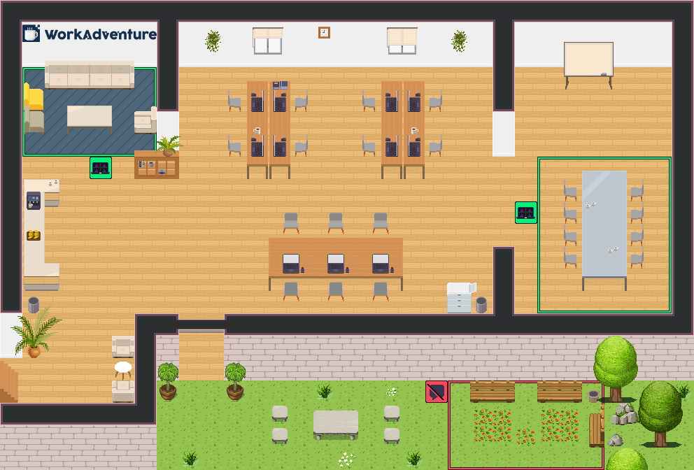

# 🗺️ WorkAdventure Map Starter Kit

<a href="https://discord.gg/G6Xh9ZM9aR" target="blank"></a>
<a href="https://x.com/workadventure_" target="blank"></a>




🗺️ This is a starter kit to help you build your own map for [WorkAdventure](https://workadventu.re).

📚 To understand how to use this starter kit, follow [our tutorial](https://docs.workadventu.re/map-building/tiled-editor/).

👨🏻‍🔧 If you have any questions, feel free to ask in the [WorkAdventure office](https://play.staging.workadventu.re/@/tcm/workadventure/wa-village).

## 🚀 Upload your map

In the `.env` file, you can set your upload strategy to `MAP_STORAGE` (default) or `GH_PAGES`. Simply comment out the option you don't want to use.

Uploading a map using the [WA map storage](https://docs.workadventu.re/map-building/tiled-editor/publish/wa-hosted) will host your project on WA servers.

Uploading a map using [GitHub Pages](https://docs.github.com/pages) will host your project on GitHub servers. It's a bit more difficult to set up, and can only be used with public repositories (or with private repositories if you have a Github active subscription).

## 🗂️ Project Structure

```
map-starter-kit/
├── 📁 app/                    # Server entry point (loads @workadventure/map-starter-kit-core)
│   └── app.ts                 # Re-exports the Express app from the core package
│
├── 📁 src/                    # Map scripts (Browser/WorkAdventure) ⚠️ REQUIRED
│   └── main.ts                # Your map scripts go here
│
│
├── 📁 tilesets/               # Map tileset images (PNG)
│
├── 📄 *.tmj                   # Map files (office.tmj, conference.tmj, etc.)
├── 📄 vite.config.ts          # Vite configuration
└── 📄 package.json            # Dependencies and scripts
```

The **server** (Express app, controllers, HTML publishing pages, static assets) is provided by the npm package **`@workadventure/map-starter-kit-core`**. Updating this dependency gives you new publishing UI and server features without changing your maps or config.

### Quick Reference

- *`src/`*: **Map scripts** (MUST be here for compilation) ⚠️
- *`tilesets/`*: All PNG tilesets
- *`app/`*: **Server entry point** – loads the core package; do not add server logic here

> [!TIP]
> - If you want to use more than one map file, just add the new map file in the root folder (we recommend creating a copy of *office.tmj* and editing it to avoid any mistakes).
> - We recommend using **512x512** images for the map thumbnails.
> - If you are going to create custom websites to embed in the map, please reference the HTML files in the `input` option in *buildmap.vite.config.js*.

### 📁 Server entry point (`app/`)

The `app/` directory contains only the **entry point** that loads the server from **`@workadventure/map-starter-kit-core`**.

- *`app.ts`*: Imports and re-exports the Express app from the core package (for Vite’s server plugin).

The actual server (Express, routes, HTML pages, upload, map storage) lives in the dependency. To get updates to the publishing UI and server behaviour, run `npm update @workadventure/map-starter-kit-core`.

> [!IMPORTANT]
> Do **not** add server logic or new controllers in `app/`. The server is fully provided by the core package.

### 📁 Map Scripts Development (`src/`) ⚠️

The `src/` directory is where you **MUST** place **all map-related scripts** that will be executed in the browser. See [src/README.md](./src/README.md) for detailed documentation and examples.

- *`main.ts`*: Main map script (referenced in `.tmj` files)

> [!IMPORTANT]
> **All map scripts MUST be placed in the `src/` directory** to be properly compiled and bundled by Vite. Scripts in this directory are:
> - Automatically transformed from TypeScript to JavaScript
> - Bundled with their npm dependencies (like `@workadventure/scripting-api-extra`)
> - Served with the correct MIME types
> - Referenced in your `.tmj` map files using paths like `src/main.ts`

> [!WARNING]
> Do not place map scripts outside the `src/` directory. They will not be compiled correctly and will cause errors in the browser.

## 📜 Requirements

- Node.js version >= 18

## 🛠️ Installation and Testing

### Prerequisites

- **Node.js** version >= 18 ([Download Node.js](https://nodejs.org/en/))
- **npm** (comes with Node.js)

### 📦 Installation

1. Clone or download this repository
2. Navigate to the project root directory
3. Install dependencies:

```bash
npm install
```

This will install all required dependencies, including Vite, TypeScript, WorkAdventure packages, and **`@workadventure/map-starter-kit-core`** (server and publishing UI).

### 🚀 Development

#### Start Development Server

Start the Vite development server with hot module replacement:

```bash
npm run dev
```

This will:
- Start the Vite dev server (usually on `http://localhost:5173`)
- Enable hot module replacement for instant updates
- Automatically transform TypeScript files in `src/`
- Serve your maps and assets

> [!TIP]
> The development server will automatically open your browser. If not, navigate to the URL shown in the terminal.

#### Test Production Build

To test how your map will behave in production:

```bash
# Build the optimized production version for your map
npm run buildmap

# Serve the generated dist/ directory with CORS headers
npm run preview

```

This will:
- Compile TypeScript to JavaScript
- Optimize and bundle all assets
- Create a production-ready `dist/` folder
- Start a preview server to test the optimized build

### 📤 Upload Your Map

#### Upload to WA Map Storage

To upload your map to the WorkAdventure Map Storage:

```bash
npm run upload
```

This command will:
1. Build your map (`npm run buildmap`)
2. Upload it to the configured WA Map Storage

> [!IMPORTANT]
> Before uploading, you need to configure your upload settings. The upload feature requires three environment variables:

1. **`MAP_STORAGE_URL`** - Your WorkAdventure Map Storage URL
   - *Local development*: Created in `.env` by the upload command
   - *CI/CD*: Add as a GitHub secret (optional)

2. **`MAP_STORAGE_API_KEY`** - Your API key for authentication
   - *Local development*: Created in `.env.secret` by the upload command
   - *CI/CD*: Add as a GitHub secret (required)

3. **`UPLOAD_DIRECTORY`** - Directory path on the storage server
   - *Local development*: Created in `.env` by the upload command
   - *CI/CD*: Add as a GitHub secret (optional)

#### Configure Upload Settings

You can configure these settings through the web interface:
1. Start the development server (`npm run dev`)
2. Navigate to the upload configuration page
3. Fill in your Map Storage credentials
4. Save and upload your map

For more details, read [the WorkAdventure upload documentation](https://docs.workadventu.re/map-building/tiled-editor/publish/wa-hosted).

### 📋 Available Scripts

| Command | Description |
|---------|-------------|
| `npm run dev` | Start Vite development server with hot reload |
| `npm run buildmap` | Build only the map files (without frontend) |
| `npm run preview` | Serve the generated `dist/` directory with CORS headers after `npm run buildmap` |
| `npm run upload` | Build and upload map to WA Map Storage |
| `npm run upload-only` | Upload map without rebuilding (requires existing build) |

## 🔄 Upgrading to a newer Starter Kit

This map is built from the WorkAdventure Starter Kit. It does not receive Starter Kit updates automatically.
To help, the kit ships an AI agent skill in [`.agents/skills/upgrade-starter-kit`](./.agents/skills/upgrade-starter-kit/SKILL.md).

Ask your coding agent to *"upgrade the starter kit"* (or run `/upgrade-starter-kit` in Claude Code). It will:

- compare your repository with the latest version of this kit, using the `version` field of `package.json` as the baseline,
- update the scaffolding: dependencies, Vite and TypeScript config, `app/`, the GitHub workflow, new `.env` keys,
- leave your map content alone (maps, tilesets, images and your own scripts),
- run `npm install` and `npm run buildmap`, then list anything it did not apply and you still have to do yourself.

## 📜 Licenses

This project contains multiple licenses as follows:

* [Code license](./LICENSE.code) *(all files except those for other licenses)*
* [Map license](./LICENSE.map) *(`office.tmj` and the map visual as well)*
* [Assets license](./LICENSE.assets) *(the files inside the `tilesets/` folder)*

> [!IMPORTANT]
> If you add third party assets in your map, do not forget to:
> 1. Credit the author and license of a tileset with the "tilesetCopyright" property by etiding the tileset in Tiled.
> 2. Add the tileset license text in *LICENSE.assets*.
> 3. Credit the author and license of a map with the "mapCopyright" property in the custom properties of the map.
> 4. Add the map license text in *LICENSE.map*.

## ❓ Need Help

If you have any questions or need further assistance, don't hesitate to ask either by [email](mailto:hello@workadventu.re) or [Discord](https://discord.gg/G6Xh9ZM9aR)!
